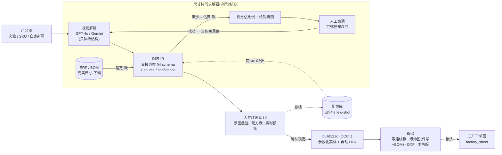

# 图生 CAD 爆炸图 — 落地方案

> 2026-06-13 定。本文 = [`绘图子程序_交接方案.md`](绘图子程序_交接方案.md)(方案 A / build123d)的 **「AI 图像前门」补充**。
> 配套记忆: [[project-drawing-wireframe-cad]]。
> ⚠️ 本轮**只出架构图 + 落地方案文档,不写代码**(用户拍板);确认后再照 §10 动手。

---

## 0. 一句话
丢一张产品图(实物 / SKU / 自家新图)→ **AI 看图填配方** → build123d 出**真 CAD 爆炸图 + DXF**。
图像理解层**叠在交接方案的 build123d 引擎之上**,引擎 100% 复用——不是推翻重做,是给已设计好的方案**加一个 AI 前门**;设计师的表单退化成「纠错 / 微调」界面。

---

## 1. 本轮拍板 (2026-06-13)
| # | 决策 | 选定 |
|---|---|---|
| 决策1 | 引擎主干 | **图 → 配方 IR → build123d(真 CAD)**。不做纯网格重建(mesh≠CAD,拿不到下料图/DXF) |
| 决策2 | 尺寸来源 | **ERP/BOM 锚定为主**;**自家新图无 ERP 记录** → 走「视觉估算 → 人工微调 → 按已钉死尺寸**视觉再估一次**」的**协同求解回环**(用户可能自己也不清楚某些尺寸) |
| 决策3 | 本轮交付 | **先出架构图 + 落地方案文档**,确认后再写代码 |

沿用交接方案的既定拍板:**独立子程序 / 独立 Docker / 放 D 盘 AI 新文件夹**(遵 [[feedback-d-drive-only]])/ **不上群晖**(R1600+OCCT 太重)/ ERP 经 `DRAWING_SERVICE_URL` HTTP 调用 / 配方与确认结果**子程序自存**(与 ERP 解耦)。

---

## 2. 架构总览



ASCII 兜底(无 mermaid 渲染时):

```
产品图(实物/SKU/自家新图)
   │ ① 视觉解析(GPT-4o/Gemini): 只解析结构(类目/抽屉数/开放格/门/把手/腿/材质)
   ▼
配方 IR ──②尺寸协同求解器──────────────────────────────────────┐
   │        ├─ ERP/BOM 锚定(硬): product_code/SKU命中→真实尺寸+下料  │
   │        ├─ 视觉估算(软): 无ERP记录/字段缺→估比例+绝对值+置信度    │
   │        └─ 人工微调(硬): 钉死已知尺寸 →【改动→视觉按约束再估一次】◄┘
   │ ③ 人在环确认: 原图叠注 | 配方表(按source着色) | build123d预览 并排
   ▼
build123d(OCCT) 建参数化实体 → ④ 自动 HLR 隐线消除
   ▼
输出: 等距线框尺寸图 │ 爆炸图(件号气泡+BOM明细) │ DXF │ 木色填充版
   │ ⑤ 回灌: 嵌入工厂下单图 factory_sheet + 存配方库(下次同SKU秒出/自学习)
```

---

## 3. 配方 IR(中间表示 — 复用交接方案 §4,字段升级)
沿用交接方案 §4 的 schema,**每个数值字段从裸数字升级为带元数据的对象**,以承载「这个尺寸是谁给的、有多确信、能不能再被估」:

```jsonc
{
  "product_code": "PPS26330070320",   // 命中→走 ERP 锚定; 自家新图为 null→走估算回环
  "category": "cabinet",
  "dims": {
    "w": {"value": 450, "source": "user",   "confidence": 1.0,  "locked": true},
    "d": {"value": 400, "source": "vision",  "confidence": 0.55, "locked": false},
    "h": {"value": 450, "source": "erp",     "confidence": 1.0,  "locked": true}
  },
  "panel_t": {"value": 18, "source": "default", "confidence": 0.9},  // 兼作比例锚
  "segments": [                          // 视觉给「相对高度比 ratio」, 求解器换算绝对值
    {"kind": "drawer", "ratio": 0.58, "handle": "push", "source": "vision"},
    {"kind": "open",   "ratio": 0.42, "shelves": 1,    "source": "vision"}
  ],
  "materials": {"carcass": "木", "front": "岩板"},
  "render": {"style": "line", "iso_deg": 30, "mirror": true}
}
```
- `source ∈ erp | bom | vision | user | solver | default`;`locked=true` = 用户钉死,求解器与视觉**不许再动**。
- segments 用**相对比例 `ratio`** 而非绝对 `h`:视觉对**比例**比对**绝对尺寸**可信得多;有了任一绝对锚(总高),求解器即可换算。

---

## 4. 视觉解析层(图 → 配方 IR 的「结构」部分)
- **Provider**:复用 Product Composer 既有配置——`OPENAI_BASE_URL` 代理(GPT-4o Vision)或 `GOOGLE_API_KEY`(Gemini)。两者 config 都已有,默认走哪个见 §12-Q1。
- **职责边界**:视觉**只解析结构**——`category` / `segments`(抽屉/门/开放格 + 各自相对高度比)/ 把手类型(none/push反弹/pull/knob)/ 腿 / 材质。**尺寸交给 §5 求解器**,不让视觉硬猜绝对毫米。
- **多视图**:同一 SKU 若图库有多张(正面 + 45° + 侧),**一起喂**→结构推断更稳(图库已按「SKU编号 SKU名.jpg」命名,可批量取)。
- **few-shot**:把已确认的 `(图 → 配方)` 样例塞进提示词,准确率**随用随涨**(配方库 §6)。
- **逐字段置信度**:输出每个结构字段的 confidence,低置信项进质检 / 在确认 UI 高亮。

---

## 5. 尺寸协同求解器 ⭐(本方案核心 — 决策2 落地)
用户拍板的关键机制:三档尺寸来源**协同**,且带「**用户改一下 → 视觉按约束再估一次**」的回环。

### 5.1 三档来源 + 优先级
1. **ERP / BOM 锚定(硬)**:`product_code`/SKU 命中 ERP → 取 `size_value`/`size_detail` + BOM 板件下料 → **锁定不动**。
2. **视觉估算(软)**:无 ERP 记录(**自家新图**)或字段缺失 → 视觉估**比例 + 绝对猜测 + 置信度**;以板厚(~18mm)或图中可见参照物作**比例锚**。
3. **用户手调(硬)**:设计师钉死自己确定的尺寸(如「总宽 800」),`locked=true`。

### 5.2 回环(约束传播 constraint propagation)
```
pass1 视觉  → 出「相对比例 ratios + 绝对猜测 + 逐字段 confidence」(比例 > 绝对值 可信)
用户钉一个绝对值
   ├─ 仅缩放: 求解器按比例瞬时缩放全部软字段(免 API,秒回)
   └─ 改动破坏比例 / 改了结构: 带「已 locked 字段」当约束 → 重调视觉再估一次 ← 用户明说
逐字段标 source + confidence → 确认 UI 按来源着色(锚定/估算/用户)
收敛即锁 → 交 build123d
```
- **省钱原则**:能纯几何缩放就不调 API;只有用户改动**破坏既有比例**或**改了结构件**时才二次调用视觉。
- **冲突处理**:用户 locked 值与 ERP 锚定冲突 → 以用户为准 + 旁注提示(定制单常态)。

### 5.3 两条路(自家新图 vs 现有 SKU)
| 场景 | 主力来源 | 求解器角色 |
|---|---|---|
| **现有 SKU**(ERP 有记录) | ERP/BOM 锚定 | 几乎不估尺寸,视觉只补结构 |
| **自家新图**(无 ERP) | 视觉估算 | 走 5.2 全回环,人工微调几轮收敛 ← 未来你自己出图的主路径 |

---

## 6. 人在环确认 UI
- **三栏**:① 原图(叠加视觉解析标注)│ ② 配方表单(可改,字段按 `source` 着色:绿=ERP锚定 / 黄=视觉估 / 蓝=用户钉死)│ ③ build123d 实时预览。
- 改一个字段 → 触发 §5.2(纯缩放 or 重估视觉)→ 预览刷新。
- 一键「确认」→ 存配方库(§6 LIB)+ 渲染最终四件套(§7)。

---

## 7. build123d 引擎 + 输出(沿用交接方案 §3 / §7)
- OCCT 建参数化实体 → **自动 HLR 隐线消除**(交接方案 §7 痛点全免)。
- 输出四件套:
  1. **等距线框尺寸图**:线稿版(发工厂)+ 木色填充版(给客户);
  2. **爆炸图分级**:① 示意爆炸(板件沿装配轴拉开,给客户/营销)② 工程爆炸 + **件号气泡 + BOM 明细表**(件号↔板件↔下料尺寸,给工厂)③ 仅线稿;
  3. **DXF**(给 CNC;精度取决于 BOM 有无板件下料尺寸,见 §12-Q4)。

---

## 8. ERP / 图库 / 下单图 集成(沿用交接方案 §5)
- **子程序对外 HTTP**:
  - `POST /api/parse-image`(**新**)— body `{image(s), product_code?}` → 返回配方 IR(含结构 + 视觉估尺寸 + 置信度);
  - `POST /api/solve-dims`(**新**)— body `{recipe_ir, locked_overrides}` → 跑 §5.2 回环,返回更新后的 IR;
  - `POST /api/render` — body `{recipe, format:"png|svg|dxf", explode_level}` → 出图(沿用交接方案 §5);
  - `GET /ui` — 设计师确认/微调界面(§6)。
- **ERP 侧**(用户确认后由主仓实现):`backend/app/services/drawing_service.py` 读 `DRAWING_SERVICE_URL`,**未配置 = 优雅降级**(同 `web_agent_service` 套路);图库/产品页加「生成爆炸图」按钮;爆炸图 + 件号表**自动嵌入工厂下单图** `factory_sheet`。

---

## 9. 技术选型与部署(沿用交接方案 §3)
- Python 3.11(本机已装)/ **build123d**(OCCT BREP 内核)/ FastAPI / 轻量前端。
- 渲染:`project_to_viewport()` 取 visible/hidden 边 → `ExportSVG` 矢量;SVG→PNG 用 `cairosvg`。
- 视觉:复用现有 `OPENAI_BASE_URL`(GPT-4o)/ `GOOGLE_API_KEY`(Gemini)。
- **独立 Docker**,放 **D 盘 AI 新文件夹**(遵 D 盘强制令),**不进 ERP 瘦镜像**,**不上群晖**。

---

## 10. 分阶段落地(在交接方案 P0–P5 上插入「图像层」)
| 阶段 | 内容 | 验收 |
|---|---|---|
| **IP0** | build123d 环境跑通(交接 P0)+ 视觉代理连通性验证 | 官方 `tech_drawing_tutorial` 出图 + 视觉 API 返回 |
| **IP1** | 单 SKU **PoC**:1 张真图 → 视觉配方 → 尺寸求解器(估算+手调回环)→ 等距 + 爆炸 | **你给的一张真实 SKU 图**出爆炸图 |
| **IP2** | ERP 锚定接入(决策2 路1)+ 多视图 + few-shot 配方库 | 现有 SKU 尺寸精确 |
| **IP3** | 爆炸图分级 + 件号气泡 + BOM 表 + **DXF 导出**(交接 P3) | 工厂版爆炸图 + DXF |
| **IP4** | 确认 UI 三栏 + FastAPI 接口(§8,交接 P4) | 设计师可看图改配方出图 |
| **IP5** | 回主仓 ERP 对接(`drawing_service` + 嵌入点,交接 P5)+ 群晖迁移 | 下单图带爆炸图 |

---

## 11. 风险与诚实边界
- **单图遮挡**:背面/内部靠脑补 → 优先**多视图 + ERP 锚定 + 人工确认**兜底,不追求纯自动。
- **视觉数尺寸/数件数不准是常态** → 正因如此才有 §5 求解器 + §6 人在环;定位是「90% 自动 + 1 键纠错」。
- **配方套不进的品类**(软体沙发 / 曲面椅):决策1 未选「两者都要」,故**本期不做 mesh 兜底**,这类先标「待定 / 走传统手稿」;若后续需要再议(对应建议方案 #7)。

---

## 12. 待你拍板的开放问题
1. **视觉 provider** 默认走哪个?GPT-4o(代理)/ Gemini(空间结构解析略强)。
2. **PoC 验收图**:先拿哪张真实 SKU 图当 IP1 基准?(给我图;若该 SKU 在 ERP 有尺寸一并告知,好验锚定)
3. **`size_value` / `size_detail` 真实格式**?(要写解析器,需 2–3 个样例)
4. **BOM 能否给板件下料尺寸**(决定 DXF 能否真出料)?还是一期 DXF 只示意?
5. **爆炸图 件号 ↔ BOM 关系**从哪来:手填 / 从 BOM 推?
6. **确认 UI**:复用 ERP 的 React 栈,还是独立简单页?

---

**下一步**:你审本方案 + 架构图 → 确认/调整 §12 → 我照 §10 从 **IP0/IP1 PoC** 动手(那时才写代码)。
